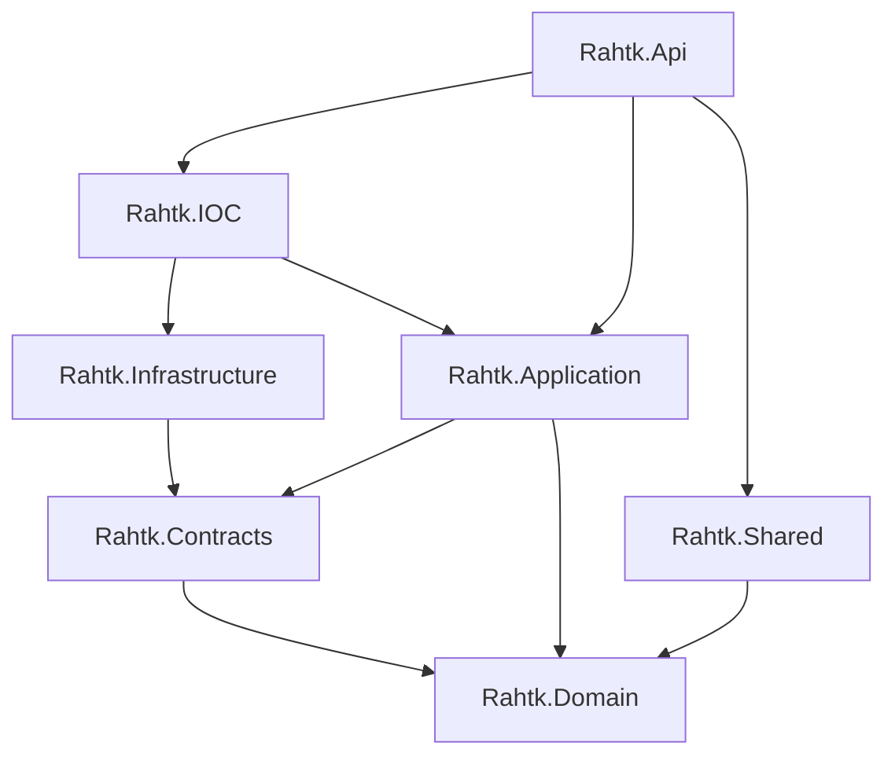

# Rahtk E-Commerce Platform Backend

Welcome to the backend of **Rahtk**, a modern, clean-architecture e-commerce platform built using **.NET 8** and **C# 12**.

This platform provides essential services for managing users, products, categories, shipping addresses, payment options, periodically scheduled purchase reminders, and push notifications.

---

## 🏛️ Architectural Overview

The solution is designed around the principles of **Clean Architecture** (Onion Architecture), separating the business logic from infrastructure and delivery mechanisms. This makes the codebase highly testable, maintainable, and loosely coupled.



### Project Components

1. **`Rahtk.Domain`**
   - **Role**: Core domain layer. Contains no dependencies on other projects, frameworks, or databases.
   - **Contents**: Domain entities (`RahtkUser`, `ProductEntity`, `CategoryEntity`, `ReminderEntity`), value objects, and core data transfer structures (`LoginDTO`, `RegistrationDTO` records).
   
2. **`Rahtk.Contracts`**
   - **Role**: Abstraction layer specifying contracts.
   - **Contents**: Repository interfaces (`IUserRepository`, `IProductRepository`, `IReminderRepository`) and the `IUnitOfWork` contract.

3. **`Rahtk.Application`**
   - **Role**: Business logic and use-case coordination layer.
   - **Contents**: Services (`ProductService`, `UserService`, `CategoryService`), object mappers, DTOs, and application interfaces.

4. **`Rahtk.Infrastructure`**
   - **Role**: Data access, database persistence, and external service implementations.
   - **Contents**: Entity Framework Core DbContext (`RahtkContext`), repository implementations, MailKit email sender (`UserNotifier`), Firebase Admin Cloud Messaging integrations (`NotificationSender`), and Hangfire background job configurations.

5. **`Rahtk.IOC`**
   - **Role**: Composition Root (Dependency Injection).
   - **Contents**: Registers repositories, services, DB contexts, Identity configurations, and Hangfire dependencies.

6. **`Rahtk.Api`**
   - **Role**: Entry point/Web API layer.
   - **Contents**: Controllers (`UserController`, `ProductController`, `CategoryController`), API middleware configuration, Swagger setups, and ASP.NET Core Request Localization.

7. **`Rahtk.Shared`**
   - **Role**: Cross-cutting concerns.
   - **Contents**: Global exception middleware (`ExceptionMiddleware`), shared base models (`BaseResponse`), and shared localization resources (`LanguageService`).

---

## 💼 Core Business Logic & Features

### 1. User Identity & Authentication Flow
- **Registration & Login**: Secure user accounts using ASP.NET Core Identity with JWT-based token authentication.
- **Email Verification & OTP**: Verification emails containing one-time passwords (OTP) sent using MailKit for password resets and verification workflows.
- **Social Login**: Integrated endpoints to authenticate users using third-party social provider details.
- **Profile Management**: Viewing and updating shipping profiles, addresses, and user-specific details.

### 2. Product Catalog & Favorites
- **Category & Products**: Organized categorizations of items featuring image uploads handled via a decoupled local file service.
- **Favorites**: Ability for users to add and manage their favorite products.

### 3. Periodic Order Reminders
- **Smart Reminders**: Users can request periodic reminders for products they purchase regularly (e.g., every 30 days).
- **Background Jobs**: Integrated with **Hangfire** and **SQL Server storage** to reliably schedule recurring notification alarms in the background.

### 4. Push & Localized Notifications
- **Firebase Integration**: Employs FCM (Firebase Cloud Messaging) to send push notifications to user devices when reminders trigger.
- **Localization**: Full support for multilingual messages (English and Arabic) using resource files (`.resx`) and ASP.NET Core localization factory.

---

## 🛠️ Tech Stack & Key Libraries

- **Framework**: .NET 8 (C# 12)
- **Database ORM**: Entity Framework Core 8 (SQL Server provider)
- **Background Job Processor**: Hangfire (SQL Server storage)
- **Email Provider**: MailKit & MimeKit (SMTP-based delivery)
- **Push Notifications**: FirebaseAdmin SDK (Google FCM integration)
- **Security**: JWT Bearer Authentication & ASP.NET Core Identity
- **Documentation**: Swagger/OpenAPI (Swashbuckle)

---

## 🚀 Getting Started

### Prerequisites
- [.NET 8.0 SDK](https://dotnet.microsoft.com/download/dotnet/8.0)
- [SQL Server](https://www.microsoft.com/en-us/sql-server/) (or LocalDB)

### Configuration Setup
In `Rahtk.Api/appsettings.json`, configure your connection strings and external credentials:

```json
{
  "ConnectionStrings": {
    "DefaultConnection": "Server=YOUR_SERVER;Database=RahtkDb;Trusted_Connection=True;MultipleActiveResultSets=true;TrustServerCertificate=True"
  },
  "Email": {
    "Email": "your-smtp-email@gmail.com",
    "Password": "your-smtp-app-password"
  },
  "Firebase": {
    "CredentialsPath": "path-to-firebase-adminsdk.json"
  }
}
```

### Running the Project

1. Apply Entity Framework migrations:
   ```bash
   dotnet ef database update --project Rahtk.Infrastructure --startup-project Rahtk.Api
   ```
2. Start the API server:
   ```bash
   dotnet run --project Rahtk.Api
   ```
3. Open Swagger UI in your browser to explore the endpoints:
   ```
   https://localhost:7233/swagger/index.html
   ```

---

## 📄 Key Formatting Standards
- **Byte Order Mark (BOM)**: All source C# files (`.cs`) must be saved in **UTF-8 with BOM** encoding.
- **Primary Constructors**: Wherever dependencies are injected, C# 12 primary constructors are preferred.
- **Records**: Data Transfer Objects (DTOs) and models should utilize C# positional `record` types to encourage immutability.
